#DAY 02

- 자료구조
    + [위키백과 참고](https://ko.wikipedia.org/wiki/%EC%9E%90%EB%A3%8C_%EA%B5%AC%EC%A1%B0)
    + [나무위키 참고](https://namu.wiki/w/%EC%9E%90%EB%A3%8C%EA%B5%AC%EC%A1%B0)
- 알고리즘
    + [위키백과 참고](https://ko.wikipedia.org/wiki/%EC%95%8C%EA%B3%A0%EB%A6%AC%EC%A6%98)
    + [나무위키 참고](https://namu.wiki/w/%EC%95%8C%EA%B3%A0%EB%A6%AC%EC%A6%98)
알고리즘 + 자료구조 --> 환상의 궁합.
- 소프트웨어 공학
- **자바스크립트 관련**
    + [데이터타입](https://developer.mozilla.org/ko/docs/Web/JavaScript/Data_structures)
    + [자료구조](https://code.tutsplus.com/tutorials/data-structures-with-javascript-whats-a-data-structure--cms-23347)

--- 

##1. 자료구조
- 컴퓨터의 기본적인 자료 구조
- 데이터를 구조적으로 표현한 방법
- 자료를 효율적으로 이용할수 있는 방법론
    + 예시) 테트리스 
        * ㄴ 자만 아니마 ㅁ자 모형도 있다면 공간을 좀더 효율적으로 사용할 수 있겠지
    + 예시) 여행가방
        * 가방의 크기, 물건의 특성에 따라 담는다 등등등 : 공간을 어떻게 효율적으로 사용할까?
- 즉, 메모리 안에서 데이터를 어떻게 효율적으로 사용할 수 있나! 

###자료구조 종류
- 원시구조 : 메모리의 한공간을 사용해서 데이터를 저장하는 굉장히 원시적인,,,,
    + 정수, 실수, 문자
    + 예시) 변수에 숫자를 할당.
- 선형구조
    + 배열, 연결 리스트, 스택, 큐, 덱
- 비선형구조 
    + 트리, 그래프


###선형구조
1. 배열
- 크기가 불변하는 자료들의 묶음.
- 장점
    + 원하는 데이터의 값을 가져다 쓸수 있다.
    + 속도가 빠르다.
- 단점
    + 크기를 변경할 수가 없다.
    + 중간에 데이터가 빌 경우 -> 자리를 빼지도 채우지도 못한다.
- 개선방법
    + 리스트!!

2. 리스트
- 배열의 단점을 개선한 형태 : 가상의 선으로 데이터들을 연결
- 각 데이터들은 주소를 가짐 + 다음 데이터의 주소까지 저장 -> 그래서 데이터끼리 연결이 가능
- 장점
    + 데이터를 사입, 삭제 가능
- 단점
    + 배열에 비해서 데이터 접근이 느림. / 배열은 원하는 테이더 바로 접근.
    + 배열에 비해 메모리가 많이 필요함.
- 연결 리스트의 종류
    + 단순 연결 리스트
        * 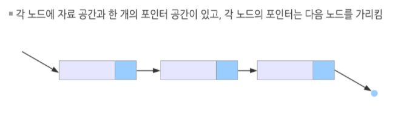
        * 다음 데이터의 주소를 저장하고 있음
        * 단점 : 100번째 데이터를 찾아가려면 100번을 물어봐야함 -> 시간이 오래 걸림
        * 개선 : 이중 연결 리스트
    + 이중 연결 리스트
        * 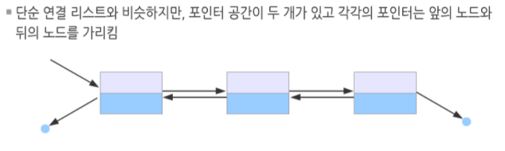
        * 이전, 다음 데이터의 주소를 저장하고 있다.
        * 단점 : 메모리..성능저하..
    + 원형 연결 리스트
        * 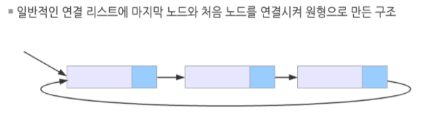
        * 반복 순환하는 형태를 가진 리스트
    + => 자료구조의 기초이며 목적에 따라 사용. 
- 예제
    ```
    데이터 : [ A , B , C , D , E ]

    가상의 선 + 주소(숫자)를 가졌다 가정
    [ 10 ] - [ 20 ] - [ 30 ] - [ 40 ] - [ 50 ]

    새로운 데이터 F(60)를 B(20)와 C(30)사이에 넣고 싶다.

    리스트 연결 과정
    1. [ 60 ] 을 [ 30 ]으로 연결후
    2. [ 20 ] 에서 [ 60 ]으로 연결된다.
    => [ 20 ]에서 바로 [ 60 ]을 연결되면 [ 30 ]으로 갈 수 있는 연결고리가 끊김 그래서 위의 순서대로 연결.

    ```


3. Stack(스택)
- 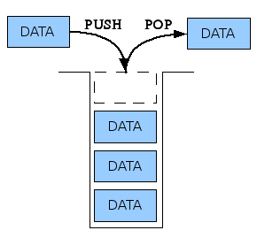
- 데이터를 차곡차곡 쌓아진 구조로 저장하는 형식
- 선입후출(First In, Last Out: FILO) : 먼저 들어간 데이터는 나중에 나오고
- 후입선출(Last In, First Out: LIFO) : 나중에 들어간 데이터는 제일 먼저 나온다.
- pop, push
- 예시) 김치냉장고, 브라우져 뒤로가기(뒤로가기 클릭하면 뒤로가지만 바로 이전페이지는 사라짐)

4. Queue(큐)
- 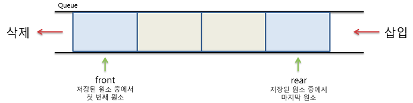
-  선입선출 (First In, First Out: FIFO) : 먼저 집어 넣은 데이터가 먼저 나온다.
-  put, get
-  예시) 화장실줄

5. Dequeue
- 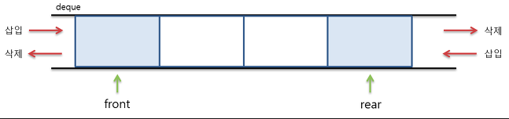
- Stack + Queue : 앞으로 뒤로 넣었다 뺐다.

=> 스택과 큐를 제일 많이 사용하게 됨.


###비선형구조

####트리
- 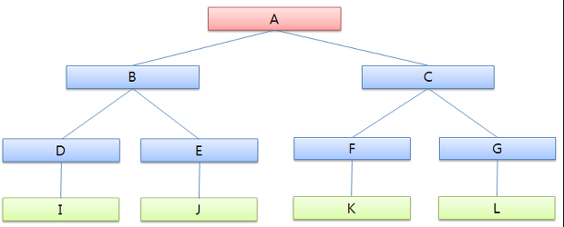
- 부모와 자식 관계로 이루어진 구조 : 
- 예) 돔, 조직도, 가계도, 폴더구조
- 장점 : 탐색의 용이성, 데이터의 세분화 구조화, 부모노드를 가지고 있어 위계질서가 있다.

####그래프
- 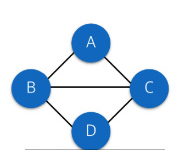
- 거미줄처럼 데이터끼리 연결되어 있는 구조 : 시작과 끝을 알수 없다.
- 예) 네비게이션, 인물관계, 페이스북 친구추천(그래프의 연결망에 걸려있음)
- 장점 : 데이터간 관계 표시할때 용이, 공통관계 파악에 용이


###**자료구조를 배우는 이유**
- 단순히 자료구조의 모양을 알고있는건 필요없다.
- 어떤 데이터에 어떻게 어디에 사용하면 유용힐까? 를 잘 생각.
- 예) 이런 데이터를 운영할껀데 어떤 자료구조를 가지고 표현하면 좋을까요?


---

##2. 알고리즘
- 문제해결를 위한 모든 절차 / 방법 -> 일처리하는 순서
- 문제에 직면했을 때 해결할 생각은 사람마다 다르고 상황에 따라 다르다.
- 배우는 이유
    + 컴퓨터는 사람처럼 일처리를 유연하게 할수없기 때문에 문제에대한 예외사항을 까지 예상해서 처리해줘야함. 매우 상세하게 순차적으로,,
    + 답은없어 하지만 어떤것을 사용했을때 효율적인지를 판단할순 있다.
    + 이런경우엔 이런방법이 좀더 적합하더라 좋더라... 


###정렬 알고리즘 종류
- 정렬 -> 일정한 규칙에(코드) 따라 컴퓨터는 데이터를 정렬한다.
- 정렬방법에 따라 (알고리즘 설계에 따라) 속도와 성능의 차이가 나타남
- 종류
    + 선택 정렬
        1. 선택된 데이터 
        2. 모든 데이터를 확인
        3. 데이터중 가장 작은 값 또는 가장 큰 값을 찾아서 앞 또는 뒤로 정렬
    + 버블 정렬
        1. 2개의 데이터를 비교 == 자신과 바로 옆(인접한) 데이터
        2. 2개중 큰거 작은거 정렬후
        3. 다시 바로옆 데이터와 비교후 정렬 .... 계속 반복
    + 삽입 정렬
        1. 선택된 데이터와 이미 정렬돼 있는 데이터에 비교
        2. 들어갈 자리를 찾아 들어가면서 정렬
    + 머지 정렬 == 병합 정렬
        1. 데이터의 영역을 분할한 후 
        2. 분할한 영역에 포함된 데이터끼리 비교해서 정렬 후 
        3. 영역을 합치면서 정렬
    + 퀵 정렬
        1. 기준점을 잡아서 
        2. 기준점 보다 작거나 큰것을 대충 정렬
        3. 또 기준점을 잡아서 대충 정렬
        4. 계속 같은일 반복하면서 정렬됨
        * 처음 나왔을 당시에 성능이 우수해서 퀵정렬이란 이름이 붙었다.
        * 기준점에 따라서 성능이 좌우됨 -> 기준점을 어떻게 잡느냐가 관건이다.
        * 기준점이 극단적이 되면 일을 너무 많이함 : 성능떨어짐
            - 예) 1~10 중에 기준을 10으로 잡아버렸을때...
    + 칵테일 쉐이커, 힙정렬(Heap Sort)..... 등
- [정렬 알고리즘을 시각화한 영상](https://youtu.be/kPRA0W1kECg)
- [참고 블러그](http://gompangs.tistory.com/46)

=> 자료의 상황에 맞게(자료의 형태에 따라) 정렬방식을 쓰면된다.

###시간복잡도(Time complexity)
- 
- 얼마나 수행시간이 걸리나? 얼마나 빠른시간에 처리할수있을까? 
- input -> output 까지 걸리는 시간
- 알고리즘이 실행되는데 소요되는 시간분석
- 점근표기법
    + 대문자 오 표기법(Big-O Notation) - 최악 : (On²)
        * 못해도 이 정도의 성능을 보일 수 있다.  
        * 제일 많이 사용.
        * 예) 보험같은 존재
    + 오메가 표기법(Omega Notation) - 최선 : (Ωn²)
    + 세타 표기법(Theta Notation) - 평균 : (Θn²)

- 정렬 알고리즘의 시간복잡도
    + 선택정렬 - O(n²)
    + 버블정렬 - O(n²)
    + 삽입정렬 - O(n²)
    + 병합정렬 - O(nlogn)
    + 퀵정렬 - O(nlogn)

- 탐색 알고리즘의 시간 복잡도
    + 선형 탐색 - O(n)
        * 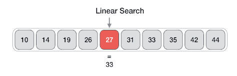
    + 이진 탐색 - O(log n) : 트리에서도 중간 값 잡는게 중요
        * 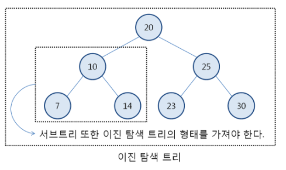
    + [참고 블러그](http://abouteverything.tistory.com/11)
- [한번 봐 : 참고 블러그 1](https://joshuajangblog.wordpress.com/tag/%EC%8B%9C%EA%B0%84%EB%B3%B5%EC%9E%A1%EB%8F%84-%EA%B3%84%EC%82%B0/)
- [한번 봐 : 참고 블러그 2](http://gompangs.tistory.com/31)
- [참고 1](http://gwpark.tistory.com/1731)
- [참고 2](http://b-jay.tistory.com/110)
- [참고 3](http://bigocheatsheet.com/)
- [시간, 공간복잡도 참고](http://ledgku.tistory.com/33)

###공간복잡도는 메모리 공간을 얼마나 사용하는지에 대해.. 나중에 한번 알아볼것


---

##3. 소프트웨어 공학
- 소프트웨어 공학이란?
    + 소프트웨어의 개발, 운용, 유지보수 및 폐기에 대한 체계적인 접근방법
    + 유용한 사물이나 환경을 구축하는 것을 목적으로 하는 학문
    + 공학은 사람을 위해서 !!!!!
===> 효율적이더라 그렇다더라.... 경험론들을 바탕으로 정리해놓은 것들을 소프트웨어 공학


**참고**
- 컴퓨터과 학과는 진짜 컴을 연구하는것
- 컴공학과는 컴이론을 기초로해서 우리가 필요로하는것을 컴퓨터로 만들어내는 곳을 컴공과


###소프트웨어 개발 생명주기 모델(Software Development Life Cycle Model)
- 소프트웨어를 어떻게 개발할 것인가에 대한 전체적인 흐름, 모든 모델들을 모아놓은,,?
- 모델 종류
    - 폭포수 모델(Warterfall model)
        + 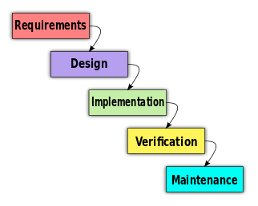
        + 각 단계를 명확하게 구분해서 개발하는 방법
        + 단계
            1. 클라이언트 요구 분석
            2. 디자인을함 : 구조설계
            3. 구현단계 
            4. 검증 : 잘나왔는지 확인
            5. 유지보수단계 :하자있음 보수 아니면 확장부탁 기능추가 등등등
        + 단점 : 뒤로 돌이킬수 없는일들이 발생됨, 앞단계가 완성이안되면 뒷단계가 일을할수없어.
    - Prototype 모델
        + 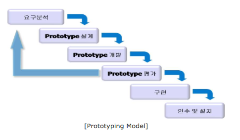
        + 포폭의 단점을 보완 : 대충만들어서 보여지게한후 진짜로 진행
        + 단계
            1. 요구 뷴석
            2. 프로토타입 (설계 개발 평가 ) == 모델하우스 == 임시적인
            3. 구현
            4. 인수 및 설치
        + 단점
            * 시간이 오래걸려 중간의 재평가 때문에,,, 커뮤니케이션 비용이 큼 클라이언트의 기다림
            * 인간이라는 특성때문에 : 요구사항이 많아짐 욕심................ 무한반복,, 
            * 가건물 프로토타입으로 설치해버림... 완변하게안하고,, 귀찮으니까,, 인간의욕심
    - 나선형 모델(Spiral model)
        + 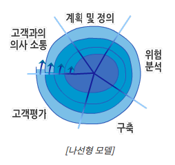
        + 프로토타입의 담점을 보완 : 폭포수 모델을 점진적으로 증가시키는 방법
        + 단계
            * 고객과의 의사소통 !!!!!!!
            * 계획정의
            * 위헙분석!!!!!!!!!
            * 구축
            * 고객평가
        + 세분화해서 하나씩 하나식 제대로 구축을 해서 합침
        + 단점 :  인간의 욕심  고객의 요구사항들의 집합체가 모여서,,, 난잡해지고 문제점발생  
        + [참고](http://gisulsa.tistory.com/231)


###소프트웨어 개발방법론
- 소프트웨어를 생산하는데 필요한 반복적인 과정들을 정리한것 : 어떻게 효율적으로 개발 해 나갈것인가?
- 구조적 프로그래밍, 개체지향, 고속 개발 방법론, 익스트림 프로그래밍(Agile), 스크럼(Agile), UP...


####Agile(애자일) 프로세스
- [의미](https://ko.wikipedia.org/wiki/%EC%95%A0%EC%9E%90%EC%9D%BC_%EC%86%8C%ED%94%84%ED%8A%B8%EC%9B%A8%EC%96%B4_%EA%B0%9C%EB%B0%9C)
- 방법론?? 아니!!!! 그냥 생각 덩어리 어케하면 빠르게 잘 개발해낼 수 있을까 라는 생각들을 경험으로 모아놓은
- 다른 고전적인 방법론과 구별되는 가장 큰 차이점은 less document-oriented, 즉 문서를 통한 개발 방법이 아나라, Code-oriented, 실질적인 코딩 통한 방법론
- 특정 개발 방법론을 가리크는 말은 아니고 "애자일(Agile = 기민한, 좋은것을 빠르고 낭비없게 만드는 것)" 개발을 가능하게 해 주는 다양한 방법론 전체를 일컫는 말
- 결국은 최우선 순위를 고객요구에 맞춰서 개발을 빠르게 노예처럼 열심히 찍어 만들어내 더욱혹독한,,,, 빨리만들어서 고객을 만족!! 개발의 후반부일지라도 요구사항 받아들임

###UML(Unified Modeling Language)
- 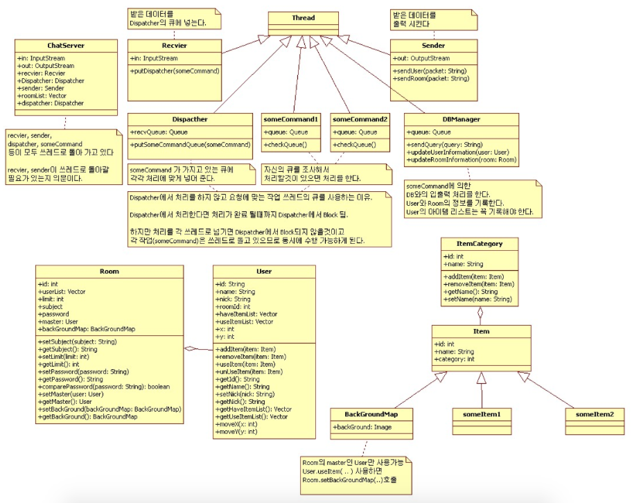
- 표준화된 범용 모델링 언어
- 객체 지향 소프트웨어 집약 시스템을 개발할 때, 산출물 명세화, 시각화, 문서화 할 때 사용

###TDD(Test-Driven Development)
- 테스트 주도 개발
- 매주 짧은 개발 사이클을 반복하는 소프트웨어 개발 프로세스
- 버그가 있는지 없는지 코드를 따로 만들어서 컴퓨터로 테스트
- 왜? : 인간보단 컴퓨터가 정확
- 단계
    + 결함을 점검하는 자동화된 테스트 케이스를 작성
    + 케이스를 통과하기 위한 최소한의 양의 코드를 생성
    + 새 코드를 표준에 맞게 리팩토링
- 단점 : 테스트하다 지침. 개발시간 촉박 

###PDD(Plan-Driven Development)
- 계획 기반 개발
- 계획을 세우고 실천하는데에 많은 시간과 노력을 할애하는 개발방법론
- 단점 : 계획시간이 길어져서 개발시간 부족

=> 정답없음 때에 따라 

###형상관리
- SW개발 및 유지보수 과정에서 발생하는 소스코드, 문서, 인터페이스 등 각종 결과물에 대해 형상을 만들고, 이들 형상에 대한 변경을 체계적으로 관리, 제어하기 위한 활동
- 변경사항들을 차곡차곡 정리

### 버전관리
- 형상관리의 일부
- 일반적인 소프트웨어 소스 코드만의 형상을 관리하는 것
- 관리도구 : SVN(Subversion), Git, Mercurial,, CVS...


---

과제
HTTP와 HTTPS는 무엇이며 그 차이는?
국내에 공인인증서가 생긴 배경과 그 위험성은? 
- [참고 1](http://devvkkid.tistory.com/10)
- [참고 2](http://weicomes.tistory.com/44)
ActiveX란 무엇인가?


