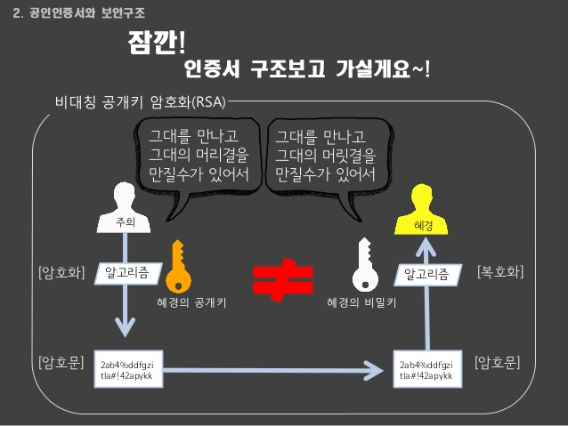

#DAY 03

##네트워크
- 그물망, 인터넷, 공유기,,, 

### 네트워크의 범위
- LAN(Local Area Network) : 근거리 통신망
- MAN(Metropolitan Area Network) : 도시권 통신망
- WAN(Wide Area Network) : 광역 통신망

###Internet
- 컴퓨터로 연결하여 TCP/IP(Transmission Control Protocol/Internet Protocol)라는 통신 프로토콜을 이용해 정보를 주고받는 컴퓨터 네트워크.
- 네트워크간의 네트워크 

###TCP/IP
- TCP/IP : 무언가를 주고 받을때 서로 제어하기 위한 전송규약(상호간의 약속)
- TCP(Transmission Control Protocol)
- IP(Internet Protocol)
- Protocol : 미리 합의된 약속, 규칙

### WWW(World Wide Web)
- 구조화된 문서(웹페이지)에 있는 정보의 저장소
- 핵심은 분산과 연결!!!
    + 정보 분산 : 필요한 정보들을 분산해서 넣을테니 필요하면 받아가~
    + 모든정보를 한곳에 넣으면 과부화
    + 연결 : 네이버 서버를 다음과 연결 할 수도 있다.

### URI
- Uniform Resource Identifier : 구조화된 리소스 식별자
- URL(Uniform Resource Locator)
    + URI의 한 종류로 하위개념이다.
    + `[Protocol]://[host]:[port]/[path]`
    + `http://www.daum.net:80/map`
    + `ftp://id:pw@193.168.1.10.777/mydir`
    + `file://localhost.movie/baseball.avi`

### Protocol (프로토콜)
- 통신 규약 (서로간의 약속)
- 장비 사이에서 메시지를 주고 받는 양식과 규칙의 체계 즉, 통신 할때 정해진 메세지 규칙
- http, https, ftp, sftp, telnet, ssh, ssl, smtp...

### HTTP
- Hyper Text Transfer Protocol
- 하이퍼텍스트를 전송하기 위한 통신 규칙
- 요즘에는 하이퍼 텍스트 전송 뿐만 아니라 다양한 곳에 이용하고 있다.
- 난 이제 웹페이지를 전송받을꺼야 ~!!

### FTP
- File Transfer Protocol
- 파일 전송을 위한 통신 규약
- 보완 X 
    - **SFTP(Secure File Transfer Protocol)**를 사용
        - Secure 보안
        - 암호화해서 보내는 방식 
- 예전에는 많이 썼지만, 요즘에는 쓰지 않는다.

### TELNET
- TErminaL NETwork (터미널 네트워크)
- 원격 로그인을 위한 프로토콜 : 원격으로 다른 컴으로 접속
- 터미널로만 명령어를 입력할 수 있고 접속가능.
- 암호화 안되어 있다.
- 해킹 같은 것.

### SSH
- Secure Shell
- TELNET의 암호화 버전
- TELNET의 대용 목적으로 설계됨.
- 네트워크 상의 다른 컴퓨터에 로그인하거나 원격 시스템에서 명령을 실해하고 다른 시스템으로 파일을 복사할 수 있도록 해 주는 응용 프로그램 또는 그 프로토콜

### SSL
- Secure Socket Layer
- 웹서버와 브라우저 사이의 보안을 위한 프로토콜
- 보안을 하지 않으면 모든 정보가 모두 털린다.

### SMTP
- Simple Mail Transfer Protocol
- 전자메일 발송 프로토콜
- 예) 관리자에게 문의할때

==> http, ftp, smtp ,,, 등이 붙은 목적은 컴퓨터에게 어떤목적으로 너에게 가는지에 대해 힌트를 준다.

### Host
- 호스트: 네트워크에 연결된 모든 장치(장비)
- 호스트 이름 : 네트워크에 연결된 장치에 부여되어 고유한 이름 , 정보에 접근하려면 주소필요
- 예) IP주소, 도메인 주소, MAC 주소 등등
    - 학생이 30명인 반에서 윤선미를 식별하는 방법은 여러가지가 있다.
    - 민증번호, 생김새...등의 방법으로

#### IP Address
- Internet Protocol Address
- 호스트를 표현하는 방법중 하나.
- 컴퓨터 네트워크에서 장치들이 서로를 인식하고 통신을 하기 위해서 사용하는 번호
- IPv4(10진수로 표현), IPv6(16진수로 표현)
- IPv4 (IP version 4 : 8bit * 4개 총 32bit (255.255.255.255))
- 지금 현재 우리가 주로 사용하는 것은 IPv4
- IPv4은 인터넷의 보급화로 포화된 상태.
    + 돌려막기로 사용중
    + 컴퓨터나, 핸드폰을 끄면 주소를 회수해 간다. => 동적할당이라고 부른다.
    + 동적할당 DHCP : 요청하면 다시 IP발급해줌.
    + 동적할당이 되면 안되는 사이트들 : 네이버 다음 같은 서비스업체 또는 피씨방
        * 고정IP를 임대. 가격이 비쌈.
- IPv6 (IP version 6 : 128bit)
    + IPv6는 나온지 오래됐지만 아직 보급화되진 않았다.
    + 왜? 통신사들의 라우터장비 교체를 안하고 있어서 IPv6지원을 안해줌
    + 점차적으로 바뀌는 중이다.
- 공인아이피는 외부에서 접속하는 아이피이다.

#### Domain Address
- 네트워크상에서 컴퓨터를 식별하는 호스트이름.
- IP주소는 사람이 외우기 어려움 
- 도메인 주소는 사람이 인식할 수 있는 주소이다.
- 문제점 : 컴퓨터는 도메인주소를 인식할 수 없다. 
    + 컴퓨터가 다른 호스트를 찾아 갈 수 있는 유일한 식별자는 IP 주소밖에 없다
    + 그래서 매칭작업이 필요하다. ==> DNS

#### DNS
- Domain Name System
- 호스트의 도메인 이름을 호스트의 네트워크 조수로 바꾸거나 그 반대의 변환을 수행
- 
    1. 주소입력
    2. 최상위 DNS에 요청 : 찾아줘~~
    3. .com을 관리하는 DNS가 있으니 거기로 가봐
    4. .com DNS에 요청 : 찾아줘~~
    5. 저기로 가봐.. 계속..
    6. 찾음
    + 브라우져창에 주소 입력후 하단에 상태를 확인할 수 있다.
        * 호스트 알아내는중..
        * IP주소 찾아가는중..
        * DNS에 물어보는중..
- 한번 알아내면 서버에서 저장을 해준다. 다음번에 접속할때 바로 보여줄수 있도록..
- 서버교체 작업후엔 DNS 싱크되는데 시간이 걸릴수 있음.

#### MAC Address
- Media Access Control Address
- 네트워크 어댑터에 부착된 식별자
- 또, 인터넷 하드웨어 주소(Ethernet hardware address, EHA), 하드웨어 주소, 물리 주소(메모리 물리 주소와 다름)로 부르기도 한다.
- 전세계적으로 겹치지 않는다.
- 네트워크 시리얼넘버 : 공장에서 찍혀나오는 번호

### Port
- 가상의 논리적 통신 연결단
- 번호로 구분
    + http: 주소 :8080
    + 80번 포트: HTTP를 주고 받을 때 사용하는 포트
    + 443번 포트: HTTPs통신을 위한 포트
- 목적에 따라 다른길로 들어감
    + 잘못된 번호를 입력하면 서버에서 접근 허용을 안함. 응답을 안해줌
    + 약속 이외의 것은 받아들이지 않음.
    + 페이지 연결 안됨.
- 신호가 들어가는 게이트(통로) 
    + 예) 배 선착장, 비행기

- TCP/UDP의 잘 알려진 서비스 포트 번호 목록 - well known port
    - 잘 알려진 포트(well-known port)는 특정한 쓰임새를 위해서 IANA에서 할당한 TCP 및 UDP 포트 번호의 일부이다. 
    - 일반적으로 포트 번호.
        - 0번 ~ 1023번 : 잘 알려진 포트 ( well-known port )
        - 1024번 ~ 49151번 : 등록된 포트 ( registered port )
        - 49152번 ~ 65535번 : 동적 포트 ( dynamic port )
- 어떤 목적으로 오고가나?
    + 개인 용도의 컴퓨터는 port가 닫혀 있다.
    + 서버 : 포트다 모두 열려있다.
    + 해커 : 방화벽시스템으로 잘 막아야한다.
    + 나쁜 Cracker들은 열려있는 port가 있는지 확인하여 범죄를 저지른다.
- 왜 컴퓨터는 0,1 을 계속 사용 하는 것일까?
    + 물리적인 환경 때문에 0과 1을 쓰고있다.(네트워트 통신구조)
    + 만약 0~5였다면
        * 5를 전달했을때 신호가 전달이 되면서 점점 줄어듬 4.9,,4.5,,4,,3.9,, 이런식으로
        * 목적지에 왔을때 이 신호가 점점 줄어드는 바람에 원래 5였는지 3이였는지 알수가 없음
        * 하지만 0~1 의 경우엔 
        * 1이 전달되었을때 줄어들어도 0이 되진않아
        * 그러니 0보다 크면 아 얘의 원래 신호는 1이구나 라는것을 파악할수 있음.

---

## HTTP

###HTTP 란?
- W3C, 월드와이드 웹이서 정보를 주고 받을 수 있도록 고안한 프로토콜
- well-known port: 80 번 사용

### HTTP 의 역사
- HTTP/0.9 : 1991 ~
- HTTP/1.0 : 1996 ~
- HTTP/1.1 : 1997 ~
- HTTP/2 : 2015 ~ 
- 아직은 1.1버전을 사용함 2버전은 아직 개발중

### HTTP Request / Response
- Request : 클라이언트에서 웹서버로 요청 (웹페이지를 요청한다.)
- Response : 웹서버에서 클라이언트로 응답 (웹페이지 보여줄께~)

### HTTP Header / Body
- Header
    + 웹서버와 클라이언트 사이에서 실질적인 데이터 정보 외에 추가적인 정보를 교환할 수 있도록 선두에 삽입되는 정보 ==> 총체적은 정보들이 들어가 있다.
    + 어떤 컴퓨터, 어떤 데이터의 형태, 어떤 프로토콜, 무엇을 요청하는지 어디로 전송되는지 등등 ...
    + User-Agent등도 request header에 들어 있다.
- Body
    + 웹 서버와 클라이언트 사이에서 전송할 실질적인 데이터 (음악, 사진, 개인정보등..)
    + content heigh, size등이 response header에 들어 있다.

### HTTP Request Methods
- 웹 서버에 요구하는 작업의 종류에 따라 요청방법을 구분 (Request Method)
- GET, POST, PUT, DELETE, HEAD, TRACE, OPTIONS, CONNECT, PATCH등

#### GET 요청
- request header의 method중 하나로 header에 적힌다.
- 요청 URI에 해당하는 자료의 전송을 요청
    + 날씨정보를 달라고 하던지, 인기검색어 정보를 달라고 하던지 등..
    + 주소뒤에 부가정보가 실려서 들어감 왜? 바디가 없어서,,
- 난 너에게 정보를 받고 싶다.
- Request body (x) : 보내는 데이터가 없다
- Response Body (o)
    + google.com 에 들어감
    + 전달하는 데이터 없다
    + 구글에서 자료를 가져와서 보여주는 형식으로 바디만 존재

#### POST
- 서버가 처리할 자료를 전송
- 자 내가 보낸 자료를 처리해, 아니면, 올려
- Request Body(O)
    + 사용자 정보를 실어서 서버에 전송
    + 주소에 들어가지 않는다. 바디에 정보가 실려서 전달.
- Response Body(O)
    + 결과에 응답해줌

#### PUT
- 해당 URI에 자료를 저장
- Request Body(O)
- Response Body(O)

#### DELETE
- 해당 URI에 자료를 삭제
- Request Body(X) : 길동이만 지워줘
- Response Body(O) : 지웠어 삭제했다는 응답 있을수도 없을수도,,

####CRUD, Data 관리 단계
- C : Create : POST
- R : read : GET
- U : Update : PUT
- D : Delete : DELETE

#### HTTP Request Status Code
- 1xx: 정보교환/조건부 응답
- 2xx: 성공
- 3xx: 리다이렉션
- 4xx: 요청 오류
- 5xx: 서버 오류

####Cookie
- 서버에 필요한 정보를 클라이언트에 임시/영구적으로 저장하기 위해 사용
- 사용자에 대한 지속적인 상태감시 및 상태참조의 목적
- 여러 페이지를 옮겨다닐 때에도 통용될 정보에 주로 이용
- 예) 사용자 이름, 아이디, 장바구니, 최근 본 상품등등
- 악성코드 및 멀웨어에 의해 읽힐 수 있어 보안에 취약
- 민감한 정보들까지 모두 저장해서 해킨당하면 전보가 다새어나감
- 보안에 신경쓸 필요가 없는 간단한 데이터를 통신간에 유지하기 위해 사용
- 처음으로 페이지를 요청할 경우 웹서버에서는 쿠키를 생성하게 되고, 페이지를 돌려 줄때 HTTP헤더에 쿠키를 포함하여 돌려주게 된다. 이렇게 넘겨 받은 쿠키는 클라이언트에서 관리하고 있다가, 다음번 요청때 쿠키를 함께 전송하게 되고, 서버에서는 쿠키 정보를 읽어 이전 상태 정보를 알 수 있게 된다. 이때 웹 서버는 정보를 변경 할 필요가 있을때 쿠키를 업데이트하여 다시 변경된 쿠키와 함께 응답하게 된다. 
- Cookie in JS
    + Read Cookie : car cookies = document.cookie
    + write Cookie : document.cookie = "user_name=jo; user_id=yagom;"
- 영구적 쿠키
    + 디스크에 저장 : 거의 사용 안함
    + 만료일 후에 삭제 
- 세션 쿠키
    + 주로 세션 정보를 보관 하기 위해 사용
    + 메모리에 저장  
    + 브라우저 종료 후 사라짐

==> 쿠키는 보안에 취약해서 세션이라는 것을 사용 : 클라이언트가 누군지 명확하게 식별하기 위해 사용

### Session
- 웹 서버가 HTTP 요청을 한 클라이언트를 식별하기 위해 사용
- 클라이언트의 최초 요청에 세션 쿠키로 서버에서 식별할 임의의 난수를 생성해서 넘김
    + 그것을 남겨둠 == 임시번호 == 오티피같은 존재
- 클라이언트의 이후 요청에 세션 ID를 헤더에 담아 보내면 서버에서는 이를 통해 클라이언트를 식별
- 민감한정보를 뿌리고다니지 않지만 보안에 강한것은 아님
- 세션이 만료되었습니다 다시 요청하세요.
- 서버에 부담이 조금 더 갈 수 있다 왜? 난수 만들어서 검증해야하기 때문에
- 안전하게 정보를 처리 할 수 있다.

**정리**
쿠키 내용을 난수한 것이 세션값 쿠키는 세션의 보조수단이 되어버림.

### Cache
- 쿠키는 웹사이트에서 쓰고남은 찌끄래기들이고 캐쉬 임시 저장장소 
- 통상적 의미
    - 데이터나 값을 미리 복사해 놓는 임시 장소
    - 웹에서는 빠른 응답을 위해 만들어 놓은 임시 저장소
- 웹 서버: 클라이언트 모델에서의 캐싱
    - 서버: 클라이언트 간 요청에 대한 응답을 저장해 두는 것
    - 서버의 부하와 접속 속도 문제 완화
    - 새로운 데이터의 갱신 문제
- html이나 자바스크립트 코드 정도.
- 예) 네이버 재이용
    + 네이버의 인덱스가 자주 바뀔까? 아닐껄.. 그러니 하드디스크의 임시저장소에 저장되어있는것을 불러옴... 만약 캐시만료일이 지나면 새로고침해서 다시 데이터를 받아옴,,,

### HTTP/2
- 현재 많이 사용되고 있는 HTTP/1.1을 개선하기 위한 차기 버전
- 아직 많이 사용되지 않고 있지만 곧 확작될 예정

#### Why HTTP/2?
- 헤더 압축 지원
    - 쿠키의 과다 사용
    - HTTP/1.1의 헤더는 너무 크고 복잡 ? 쿠키들의 덩치가 커져서.. 
        - 전송요청이 될대마다 버거움 => 속도 저하의 원인이 됨
- 너무 빈번한 Round-trip (== 왕복 == 요청되고 전송을 한번 한것)
    + 문제.. => 그렇다면 전송횟수를 줄여보자 라는 의미로 HTTP/2가 나오게됨
    - 한 번의 요청으로 다양한 데이터 응답 가능
    - 
        1.요청
        2.서버에서 한방에 다 보내줄께(이미지 스크립트 인덱스 동영상,,등을 차례대로 보내줄께 데이터)
        3.그러니 브라우져 니가 분석해서 사용해!!!
        - => 이것이 기본컨셉 : 헤더가 방대해도 한번만 보내지기 때문에 무리가 없어

**패킷이란?**
- 패킷 왔다 갔다 라는 말 
- 리퀘스트 갔다 리스펀스 왔다 라는것과 동일 
- 네트워크를 통해가는 정보를 통틀어서 패킷이라고 한다.

### 소켓 통신
- 실시간 서버와 클라이언트간에 서로 수로를 만들고 통신(감시)를 한다. == 너와 나의 연결고리
- 계속 감시 == 단발성 아님 == 자원소모 큼 == 비용이 많이 든다.
- 관리하기 까다롭기 때문제 현재는 많이 추구를 하지 않는다.(예전에 게임, 채팅에 사용했다.)
- 서버의 부하를 줄여기주위해서 대체하는 통신이 플링이다.

**참고**
- http는 응답, 요청뿐 단발성이다.
- 소켓은 지속적.

---

## 암호화
- 암호화 및 복호화

### 암호화 기법
- 해시
- 대칭키
- 공개키(비대칭키)

### 해시 함수
- 옛날사용, 암호화 기법은 아님 흉내를 낸거임 
- 임의의 데이터 (암호등)를 고정된 길이의 데이터로 매핑하여 원래의 입력값과의 관계를 찾기 어렵게 만든 것
- 복호화가 안된다.
- 어디에 어떻게 쓰이는가?
    - 해시함수를 통해 임의의 데이터를 이상한 언어로 바꿈
    - 회원가입 암호를 바꿔 
    - 바뀐암호를 DB에 보냄 서버는 저장을 해놓음
    - 재로그인할때 변형된 언어로 전달됨 서버에 저장된 변형된 것과 맞는지 확인
    - 변형된 값은 다시 돌아오지 않음
    - 하지만 비번 찾기 안됨 재설정만됨
    - 변형된 언어는 규칙이 있기 때문에 다다다 맞춰볼수 있음
    - 자물쇠중에 번호티를 하나하나 다 맞춰보는 것처럼.. 테이블로 만들면 다 맞춰버릴 수 있지
        - 레인보우테이블 이라고 하더라.
    - 소규모나 옛날 사이트에서 볼수있다.
- SHA, MD5 등

### 대칭키 암호화
- 대칭키는 암호화, 복호화 키가 동일한 알고리즘
- 키를 소유한 사람은 누구든지 복호화 할 수 있다. => 키가 노출되면 끝 == 보안미약
- DES, AES, SEED 등
- 비대칭키의 보조도구로 사용됨
- 인증서 방식은 대칭키 암호화 방식인데 암호키를 개인이 가지고 있어 노출이 위험하다.
- 활용 : 내컴에서 파일에 암호걸때 하드에 저장하고 암호입력해서 불러오고

### 공개키(비대칭키) 암호화
- 대칭키 보단 보안이 세다. 
- 공개키로 암호환된 데이터를 비밀키를 사용하여 복호화 할 수 있는 암호화 알고리즘
- 공개키, 개인키라 불리는 2개의 키가 사용 : 암호화할때랑 풀때의 키가 다름
    - 공개키
        + 다른 사용자가 암호화를 하여 나에게전달 하고자 할 때 공개키를 이용해서 암호화 한다.
    - 개인키
        + 공개키로 암호화된 데이터를 복호화 하는데 사용 되는 키이다. 
        + 개인키는 안전하게 보관해야 하며 공유되어서는 안된다. == 나혼자 가지고있는키
- RSA 등
- 단점: 알고리즘 자체가 복잡하고 연산이 많이 들어간다. 시스템에서 자원을 많이 소모한다. 복호화키가 털리면 끝. 완변한 암호는 없음
- 활용방법
    - 대칭키의 키를 전달하기 위한 방식으로 비대칭키 방식을 한번 진행.
    - 뭔소리?
        + 두키 모두 비대칭 방식을 사용하는 것이 아니라 처음에 키를 보낼때만 비대칭키를 사용하고 나중엔 대칭키를 사용해서 자료를 주고받자
        + 왜? 대칭키의 알고리즘이 간편.
- 사용 : https 방식에서 쓰인다. 인증기간에서 한번 더 물어보게 한다. 안전한 방식.
- https 통신방식은 자체 암호화가 돼있기 때문에 사실 인증서가 필요없다. 그러나 우리나라에서 인증서가 쓰이는 이유는 정부 법 때문이다.

**참고**
- 공인인증서
    - 배경
        - 미국에서는 자국기술보호를 위해 알고리즘을 공개안함. 
        - 우리나라 독자적인 암호화 방식을 만듬 그것이 SEED방식
        - 그래서 액티브 엑스라는 것을 사용하게 됐음
        - 나라에선 이 것을 법으로 규정함. 그 당시엔 최선의 선택이였지만
        - 이것을 법제화 했다는 것이 큰 단점
    - 문제 
        - 엑티브엑스 경제적 손실을 안기고 있음
        - 웹표준이 아님 합당한 방법이 아님 기술표준이 아님
        - 오로지 익스플로어에서만 사용가능.
    - 

- 네이버, 다음 로그인 페이지가 다로있는 이유?
    - https페이지로 연결시키기 위해 생김
    - 암호화하면 너무 트래픽이 많아지니까,, 걍 쓰고,, 돈이 들거든 하지만 로그인하고 돌아오면 http임.
    - 하지만 모바일은 데이터 정보량이 작으니까 https통신을 해줌. 구글 같은 곳은 너의 정보 검색도 다 암호화해줌.

- 암호화 기법, SSL을 사용하는 이유는 ==> 서버와 암호화통신을 하기 위한

- 통신 방법에 대해 생각해봐 이젠 https를 사용해야 한다.

